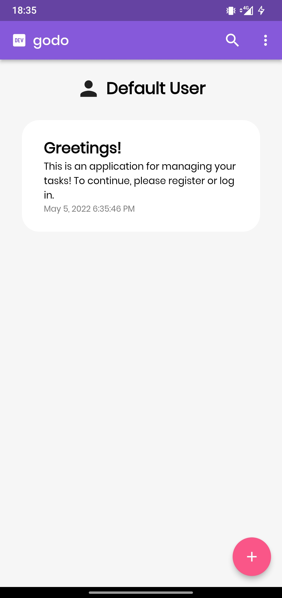
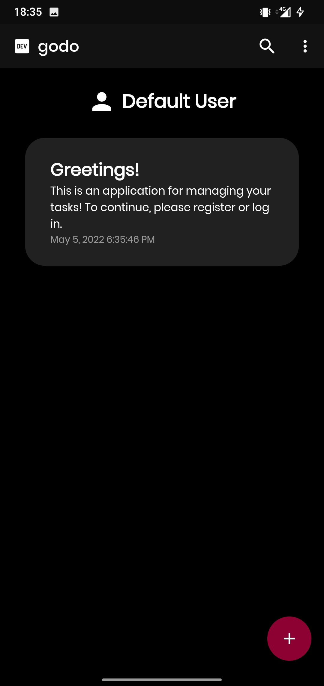
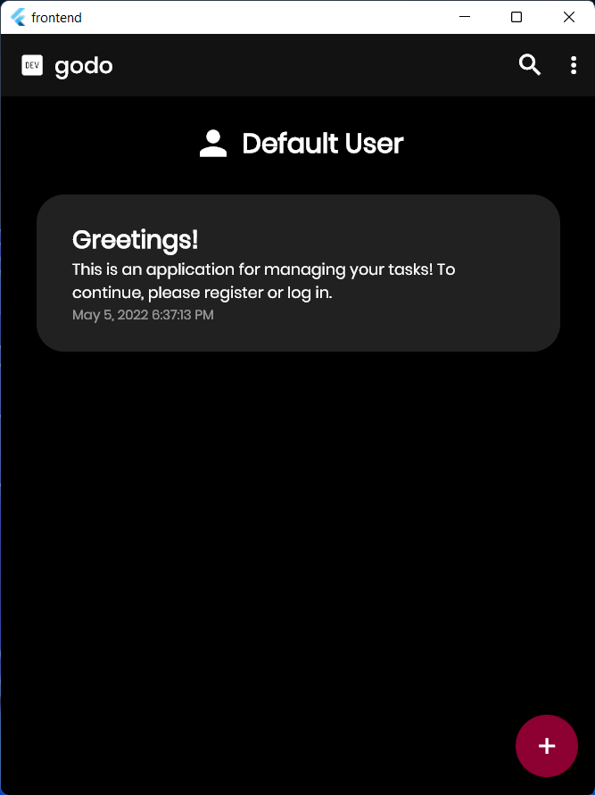

# godo

This is an applcation used for managing todo tasks.

It uses `go` for backend and `flutter` for the UI.

It is hosted at [Heroku](https://godo-web.herokuapp.com)

## Details

For more detailed README, read README.md at `frontend` or `backend` folders.

## Screenshots

Screenshots from Android:

Screenshot from Windows:

